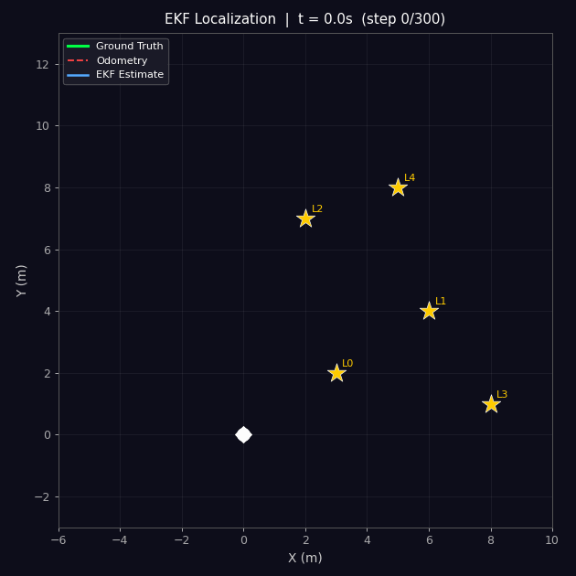
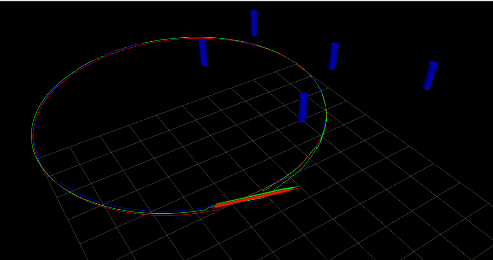
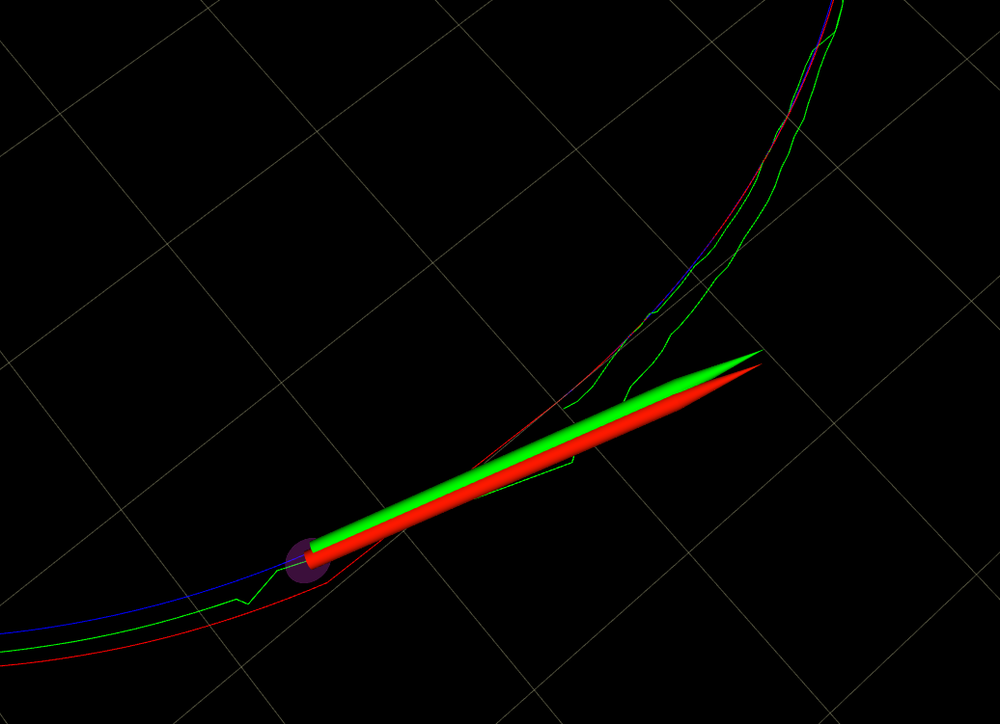
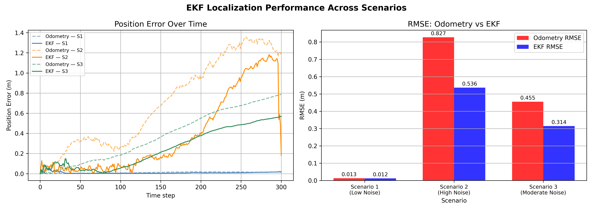

# EKF Localization with Landmark Observations

A from-scratch implementation of an **Extended Kalman Filter (EKF)** for 2D robot localization, integrated into a **ROS 2 Humble** node. The filter fuses noisy wheel-encoder odometry with simulated range-bearing landmark observations to produce a corrected pose estimate.

---

## Demo



> **Green** = Ground Truth &nbsp;|&nbsp; **Red dashed** = Noisy Odometry &nbsp;|&nbsp; **Blue** = EKF Estimate &nbsp;|&nbsp; **Blue ellipse** = 2σ covariance

---

## Project Structure

```
ekf_proj/
├── data/                          # Pre-generated simulation data (.npy)
│   ├── ground_truth.npy
│   ├── odometry.npy
│   ├── landmarks.npy
│   ├── observations.npy
│   ├── scenario_1/                # Low noise
│   ├── scenario_2/                # High noise
│   └── scenario_3/                # Moderate noise
│
├── ros2_ws/                       # ROS 2 workspace (Docker)
│   └── ekf_localisation_project/
│       ├── Dockerfile
│       ├── docker-compose.yml
│       ├── rviz_config.rviz
│       └── src/ekf_package/
│           └── ekf_package/
│               ├── ekf.py                  # Core EKF math (no ROS dependency)
│               ├── ekf_node.py             # ROS 2 subscriber/publisher node
│               └── simulation_publisher.py # Publishes simulated sensor data
│
└── analysis/                      # Standalone Python analysis scripts
    ├── ekf.py                     # Copy of core EKF (self-contained)
    ├── simulation.py              # Data generation script
    ├── odometry_trajectory_plot.py
    ├── odometry_error_plot.py
    ├── ekf_all_scenarios_plot.py  # Trajectory plots across noise scenarios
    ├── compare_rmse.py            # RMSE bar chart + error curves
    ├── ekf_animation.py           # Generates the GIF above
    └── plots/                     # All output images (auto-created on run)
        ├── rviz_plots/
        └── ...
```

---

## Mathematical Framework

The EKF linearises the non-linear motion and measurement models using Jacobians.

### Motion Model

```
x_t     = x_{t-1} + v·Δt·cos(θ_{t-1})
y_t     = y_{t-1} + v·Δt·sin(θ_{t-1})
θ_t     = θ_{t-1} + ω·Δt
```

**State Jacobian G_t** (3×3) and **Control Jacobian V_t** (3×2) are derived analytically — see `ekf.py`.

### Measurement Model (Range-Bearing)

For a landmark at `(m_x, m_y)` and `q = (m_x−x)² + (m_y−y)²`:

```
r   = √q
φ   = atan2(m_y − y, m_x − x) − θ
```

### EKF Predict–Update Cycle

| Step | Equation |
|------|----------|
| Predict state | `x̄_t = g(x_{t-1}, u_t)` |
| Predict covariance | `Σ̄_t = G_t Σ_{t-1} G_t^T + V_t M_t V_t^T` |
| Kalman gain | `K_t = Σ̄_t H_t^T (H_t Σ̄_t H_t^T + R_t)^{-1}` |
| Update state | `x_t = x̄_t + K_t (z_t − h(x̄_t))` |
| Update covariance | `Σ_t = (I − K_t H_t) Σ̄_t` |

---

## RViz Visualisation

<!-- Add your best RViz screenshot here -->


The ROS 2 system publishes three paths simultaneously to RViz:

| Topic | Colour | Description |
|-------|--------|-------------|
| `/true_path` | Green | Ground truth from simulation |
| `/odom_path` | Red | Raw noisy odometry |
| `/ekf_path` | Blue | EKF corrected estimate |
| `/landmarks` | Blue cylinders | Known landmark positions |
| `/ekf/estimated_pose` | — | Current pose + covariance |



---

## Results

### EKF Update Step Trace (first 10 steps, Landmark L0)

This table shows the filter correcting the state estimate at each timestep as
landmark L0 comes into range. Notice `σ_xx` decreasing with each update —
the filter becomes more confident as it accumulates observations.

| Step | LM | Range (m) | Bearing (rad) | EKF x | EKF y | σ_xx (before) | σ_xx (after) |
|------|----|-----------|---------------|-------|-------|---------------|--------------|
| 1  | L0 | 3.742 | 0.588 | -0.036 | -0.082 | 0.10010 | 0.04842 |
| 2  | L0 | 3.776 | 0.698 |  0.003 | -0.122 | 0.04848 | 0.04016 |
| 3  | L0 | 3.180 | 0.461 |  0.222 | -0.075 | 0.04036 | 0.03686 |
| 4  | L0 | 3.324 | 0.883 |  0.359 | -0.100 | 0.03682 | 0.03499 |
| 5  | L0 | 2.570 | 0.276 |  0.510 |  0.049 | 0.03509 | 0.03411 |
| 6  | L0 | 3.188 | 0.577 |  0.565 |  0.059 | 0.03404 | 0.03280 |
| 7  | L0 | 3.109 | 0.614 |  0.661 |  0.053 | 0.03270 | 0.03176 |
| 8  | L0 | 2.826 | 0.861 |  0.860 |  0.018 | 0.03147 | 0.03078 |
| 9  | L0 | 2.053 | 0.396 |  0.950 |  0.141 | 0.03064 | 0.03023 |
| 10 | L0 | 2.718 | 0.232 |  0.907 |  0.267 | 0.03003 | 0.02931 |

### Trajectory Comparison at Key Timesteps (Base Scenario)

| Step | GT (x, y) | Odometry (x, y) | EKF (x, y) | EKF Error (m) | Odom Error (m) |
|------|-----------|-----------------|------------|---------------|----------------|
|  10  | (0.994, 0.090) | (0.976, 0.044) | (0.907, 0.267) | 0.1975 | 0.0493 |
|  25  | (2.403, 0.588) | (2.392, 0.438) | (2.538, 0.529) | 0.1470 | 0.1506 |
|  50  | (4.230, 2.256) | (4.299, 1.941) | (4.275, 2.224) | 0.0555 | 0.3230 |
|  75  | (5.034, 4.596) | (5.148, 4.324) | (4.937, 4.580) | 0.0981 | 0.2952 |
| 100  | (4.617, 7.035) | (4.652, 6.771) | (4.681, 7.074) | 0.0749 | 0.2663 |
| 150  | (0.805, 9.943) | (0.729, 9.270) | (0.765, 9.808) | 0.1405 | 0.6773 |
| 200  | (-3.701, 8.306) | (-3.576, 7.373) | (-3.478, 7.950) | 0.4202 | 0.9415 |
| 250  | (-4.759, 3.630) | (-4.011, 2.587) | (-3.823, 3.157) | 1.0483 | 1.2823 |
| 300  | (-1.395, 0.213) | (-0.367, -0.359) | (-1.246, 0.076) | 0.2026 | 1.1762 |

> EKF error grows in the second half of the trajectory (steps 200–250) where
> landmarks are sparse, then recovers toward step 300 as the robot re-enters
> landmark range — demonstrating the correction behaviour of the filter.

### RMSE Across Noise Scenarios




| Scenario | Odometry RMSE (m) | EKF RMSE (m) | Improvement |
|----------|-------------------|--------------|-------------|
| Scenario 1 — Low Noise      | 0.0130 | 0.0125 | ~4%  |
| Scenario 2 — High Noise     | 0.8273 | 0.4965 | ~40% |
| Scenario 3 — Moderate Noise | 0.3241 | 0.0960 | ~70% |

The EKF provides the strongest improvement under moderate noise — where the
motion model is uncertain enough that landmark corrections are significant, but
sensor noise is low enough that the update step is trustworthy.

---

## Running the Project

### Option A — ROS 2 (Docker)

```bash
cd ros2_ws/ekf_localisation_project

# Build and start container
docker-compose up --build

# Inside container — Terminal 1
colcon build && source install/setup.bash
ros2 run ekf_package simulation_publisher

# Inside container — Terminal 2
ros2 run ekf_package ekf_node

# Terminal 3 — launch RViz
rviz2 -d rviz_config.rviz
```

### Option B — Standalone Python Analysis (no ROS needed)

```bash
cd analysis/

# Generate simulation data (only needed once)
python3 simulation.py

# Trajectory and error plots
python3 odometry_trajectory_plot.py
python3 odometry_error_plot.py

# Scenario comparison (requires data/scenario_1,2,3/)
python3 ekf_all_scenarios_plot.py
python3 compare_rmse.py

# Generate GIF animation
python3 ekf_animation.py
```

All plots are saved to `analysis/plots/` automatically.

### Requirements

```
Python >= 3.8
numpy
matplotlib
pillow          # for GIF generation
```

```bash
pip install numpy matplotlib pillow
```

For ROS 2: Docker and docker-compose are sufficient — no local ROS install needed.

---

## Noise Parameters

| Parameter | Symbol | Description |
|-----------|--------|-------------|
| `ODOM_V_STD` | σ_v | Linear velocity noise std dev |
| `ODOM_OMEGA_STD` | σ_ω | Angular velocity noise std dev |
| `RANGE_STD` | σ_r | Range measurement noise std dev |
| `BEARING_STD` | σ_b | Bearing measurement noise std dev |
| `MAX_RANGE` | — | Maximum landmark detection range (5.0 m) |

| Scenario | σ_v | σ_ω | σ_r | σ_b |
|----------|-----|-----|-----|-----|
| 1 — Low Noise      | 0.005 | 0.002 | 0.05 | 0.010 |
| 2 — High Noise     | 0.200 | 0.100 | 0.50 | 0.150 |
| 3 — Moderate Noise | 0.050 | 0.020 | 0.20 | 0.050 |

---

## References

- S. Thrun, W. Burgard, D. Fox — *Probabilistic Robotics*, MIT Press, 2005
- R. Siegwart, I. R. Nourbakhsh — *Introduction to Autonomous Mobile Robots*, MIT Press, 2011
- [ROS 2 Humble Documentation](https://docs.ros.org/en/humble/)